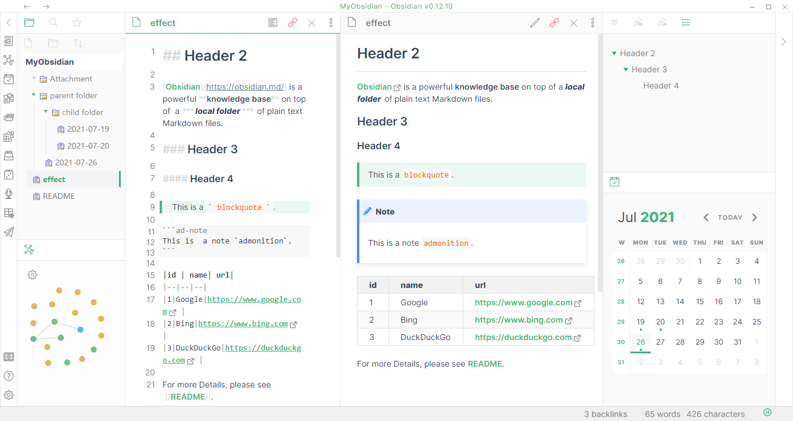
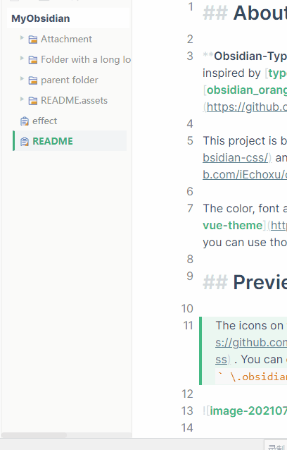
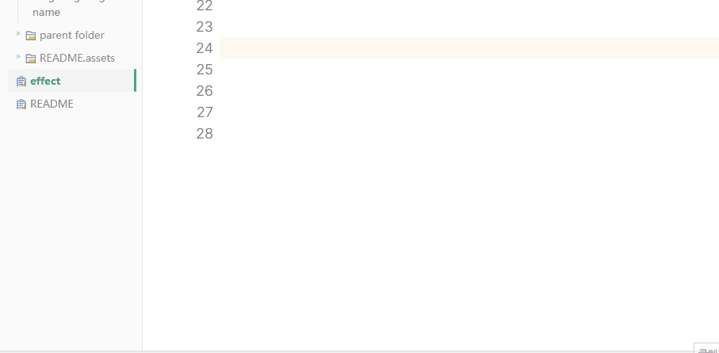
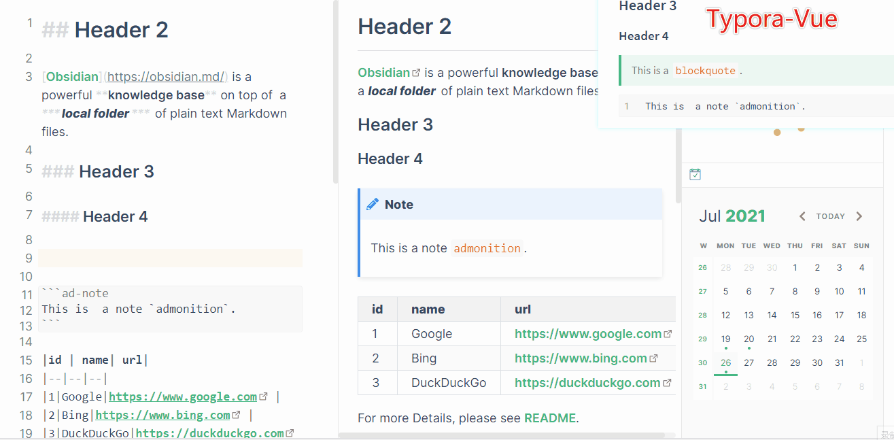
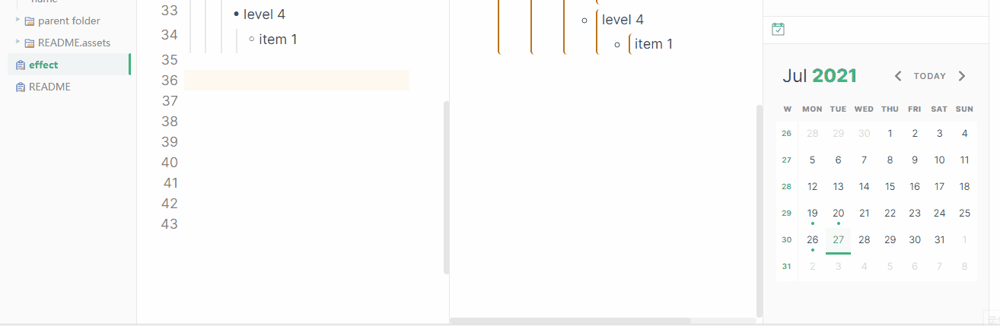
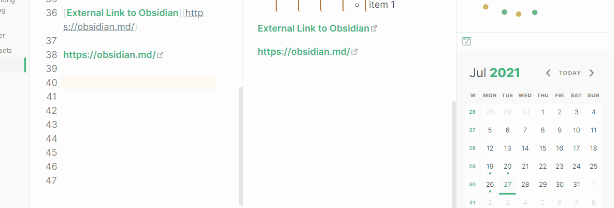
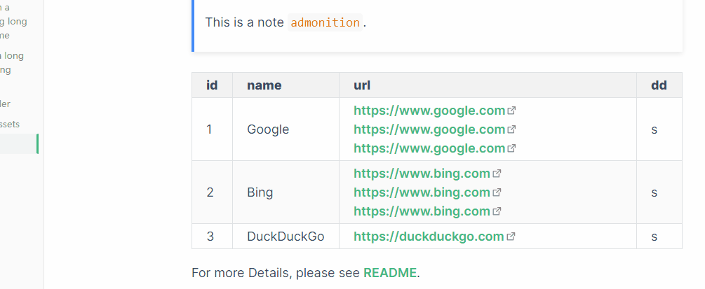
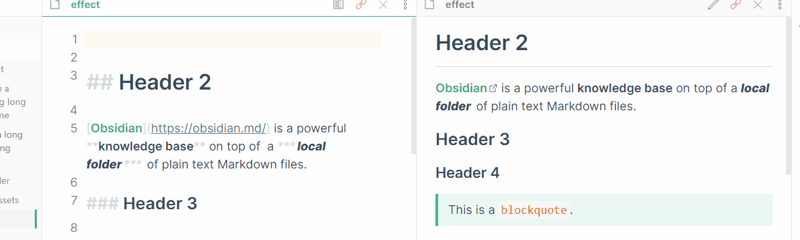
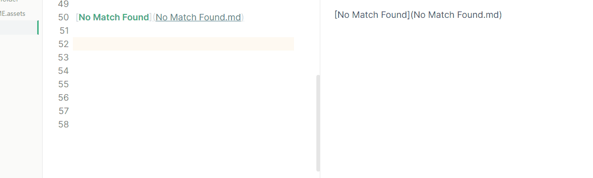

## About

[Obsidian-Typora-Vue](https://github.com/ZekunC/Obsidian-Typora-Vue-Theme) is a theme for [Obsidian](https://obsidian.md/), which is inspired by [typora-vue-theme](https://github.com/blinkfox/typora-vue-theme), [obsidian_orange](https://github.com/iEchoxu/obsidian_orange) and [Blue Topaz](https://github.com/whyt-byte/Blue-Topaz_Obsidian-css/).

This project is based on [Blue Topaz](https://github.com/whyt-byte/Blue-Topaz_Obsidian-css/) and some code of my project is from [obsidian_orange](https://github.com/iEchoxu/obsidian_orange). Thank them very much.

The font color, font size and all style is choosed elaborately to be as similar with [typora-vue-theme](https://github.com/blinkfox/typora-vue-theme) as possible so that you can use these two kinds of software simultaneously and switch in a low-cost way.

## Preview

> The icons on folder and file title in navigation are from [obsidian_orange](https://github.com/iEchoxu/obsidian_orange/blob/main/.obsidian/snippets/iconfont.css) . You can optionally use it by downloading and moving it to your local `\.obsidian\snippets\`. I will use it in the following rest of the document.

## Feature

#### 1. Hover on Header in Preview View 

#### 2. File/Folder Tittle of The Navigation in Single Line or Multi Lines

|          **Multi Lines**          |                         Single Line                          |
| :-------------------------------: | :----------------------------------------------------------: |
|              Default              | Download the css snippet `nav-single-line.css`  to your local`\.obsidian\snippets\`additionally |
|     Green border in the right     |                   Green border in the left                   |
|  |                             |

#### 3. Various Style of Mark of Unordered List in Editor View(*of course  in preview view too*)

#### 4. Orange Inline Code Style, Gray CodeBlock Style and Green Blockquote Style Like [typora-vue-theme](https://github.com/blinkfox/typora-vue-theme) in Both Editor and Preview View

#### 5. Green and Bold Weight Link Style Like [typora-vue-theme](https://github.com/blinkfox/typora-vue-theme) in Both Editor and Preview View

**External Link**

**Internal Link**

#### 6. Table Style Modified from [Blue Topaz](https://github.com/whyt-byte/Blue-Topaz_Obsidian-css/)  Like [typora-vue-theme](https://github.com/blinkfox/typora-vue-theme) in Preview View

#### 7. Supporting  Other Feature From [Blue Topaz](https://github.com/whyt-byte/Blue-Topaz_Obsidian-css/) 

**Color Tag**

**Line or Border of Unordered/Ordered List in Both Editor View and Preview View**

## Install

Manually download the `obsidian.css`to your local `\.obsidian\themes\` and rename it to `Obsidian-Typora-Vue.css`.

(Hopefully, the theme can be added to community theme list someday !!!😃)

## Contributing

Issues and PRs are welcome.

