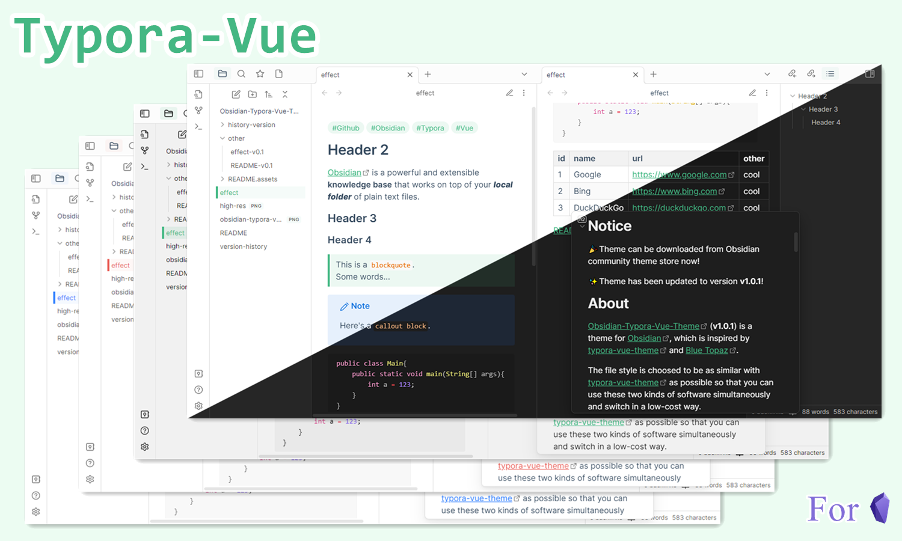
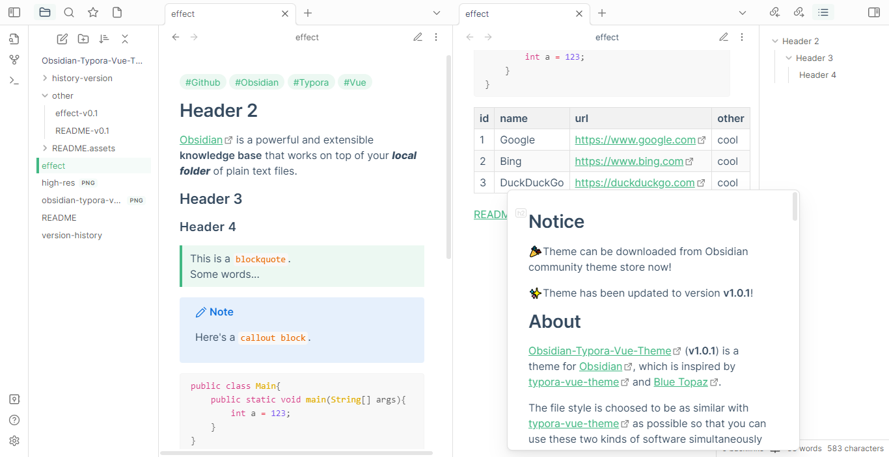
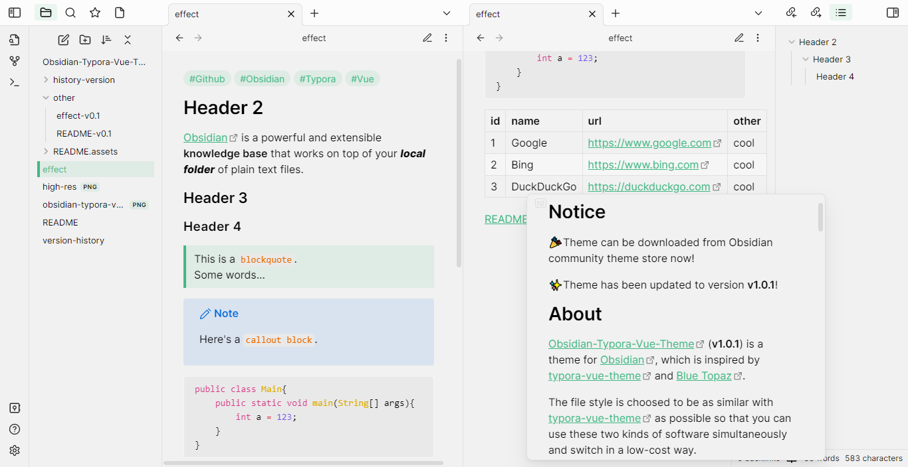
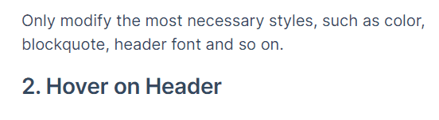
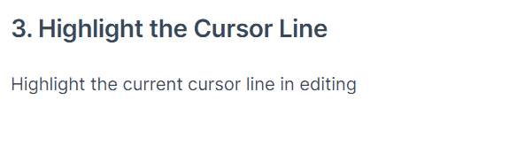
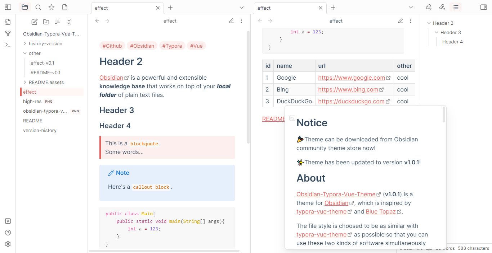
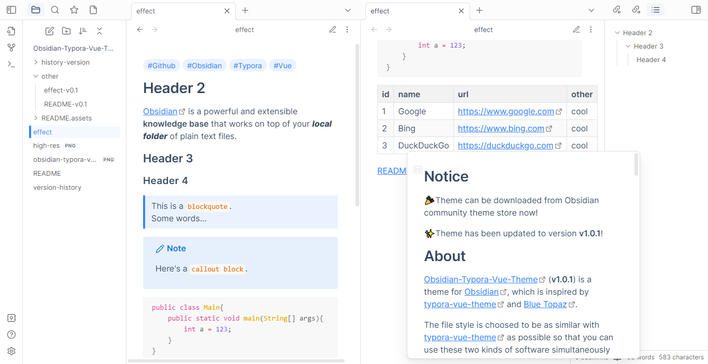

[](https://obsidian.md/) [](https://github.com/ZekunC/Obsidian-Typora-Vue-Theme/issues) [](https://github.com/ZekunC/Obsidian-Typora-Vue-Theme/issues?q=is%3Aissue+is%3Aclosed) [](https://github.com/ZekunC/Obsidian-Typora-Vue-Theme/releases) [](https://github.com/ZekunC/Obsidian-Typora-Vue-Theme/stargazers) 

## Notice

🎉Theme can be downloaded from Obsidian community theme store now!

✨Theme has been updated to version **v1.0.1**!

## About

[Obsidian-Typora-Vue-Theme](https://github.com/ZekunC/Obsidian-Typora-Vue-Theme) (**v1.0.1**) is a theme for [Obsidian](https://obsidian.md/), which is inspired by [typora-vue-theme](https://github.com/blinkfox/typora-vue-theme) and [Blue Topaz](https://github.com/whyt-byte/Blue-Topaz_Obsidian-css/).

The file style is choosed  to be as similar with [typora-vue-theme](https://github.com/blinkfox/typora-vue-theme) as possible so that you can use these two kinds of software simultaneously and switch in a low-cost way. 

## Screenshot



## Feature

### 1. Eye Protection Color Snippet

You may think that the pure white background color is too bright to read, so I give an [./other/eye-protection-color.css](./other/eye-protection-color.css) snippet with modified gray color. You can use it **after installing this theme**.



### 2. Less is More

Only modify the most necessary styles, such as color, blockquote, header font and so on. You can get the colors in [Color-picker](#Color-picker). 

### 3. Hover on Header

Available in both editing view and reading view.



### 4. Highlight the Cursor Line

Highlight the current cursor line in editing view.



### 5. Easily Change the Accent Color

If you also try other theme color but still remain the rest style, you *ONLY* need to set the Accent Color as what you like from `Obsidian -> Settings -> Appearance -> Accent Color`.

Some accent colors I recommend :

`#e95f59` from [Drake-light in Typora](https://github.com/liangjingkanji/DrakeTyporaTheme)



`#3884ff` from [Gitbook-Azure in Typora](https://github.com/h16nning/typora-gitbook-theme)



## Color-picker

```txt
accent color: #42b883
normal text: #34495e
block quote: hsla(accent color, 0.1)
inline code text: #e96900
inline/block code background: #f8f8f8
table header: #f2f2f2
table gap tr: #fafafa
highlight cursor line: rgba(245,204,142,0.12)
```

## History Version & Change Log

Please see [version-history.md](./version-history.md).

## Install

### Community Theme Store (Recommended)

Search `Typora-Vue` in Obsidian community theme store and download it.

### Manually

Manually download the `theme.css` or `obsidian.css` from [Releases](https://github.com/ZekunC/Obsidian-Typora-Vue-Theme/releases) to your local `\.obsidian\themes\` and rename it to `Obsidian-Typora-Vue.css`.

## Contributing

Issues and PRs are welcome.

